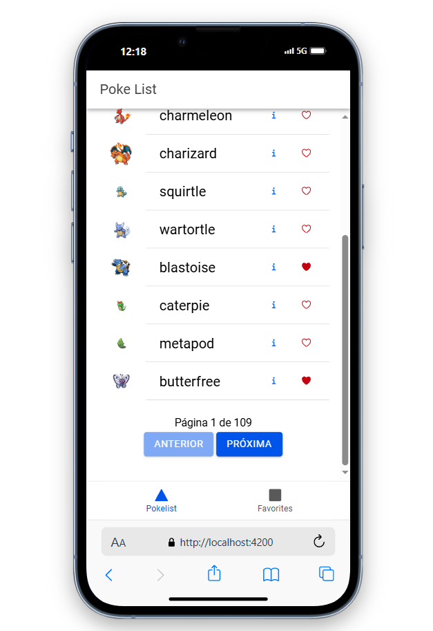
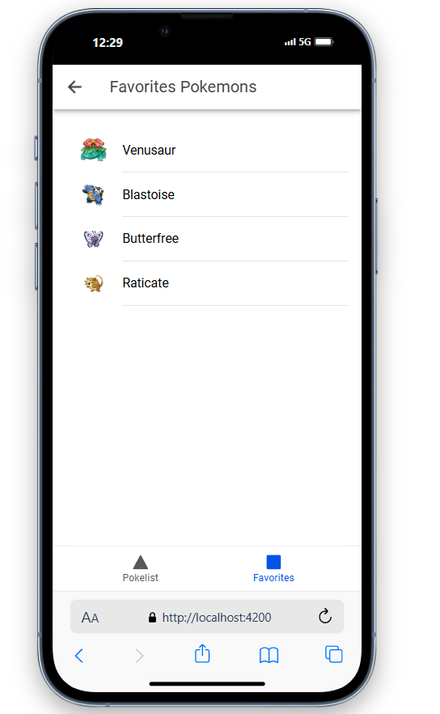

# Pokédex App

Este projeto é uma aplicação Ionic com Angular que consome a API pública do Pokémon (PokeAPI) para listar, detalhar e favoritar Pokémons.  
A arquitetura foi baseada no padrão de separação de responsabilidades: serviços cuidam da comunicação com a API, componentes controlam a interface e navegação.  
Utilizei o Angular Standalone Components para simplificar a estrutura do projeto e tornar os componentes mais modulares.  
As rotas foram organizadas com `tabs` para facilitar a navegação entre Pokédex e Favoritos, seguindo o padrão de navegação de aplicações móveis.  
O estilo de codificação segue boas práticas do Angular: uso de `async/await` em serviços, nomenclatura semântica e componentes reutilizáveis.  
Para armazenar os favoritos, utilizei `localStorage` por simplicidade e compatibilidade com web e mobile.  
A lógica de favoritos foi encapsulada em um `FavoriteService`, promovendo reutilização e testabilidade.  
A renderização de dados considera estados assíncronos com `*ngIf` e `ionViewWillEnter` para atualizar a tela ao navegar entre abas.  
A aplicação busca ser responsiva e leve, com design focado em clareza e usabilidade, utilizando componentes nativos do Ionic.  
**Para rodar o projeto em outra máquina:** clone o repositório, execute `npm install` e depois `ionic serve` para iniciar a aplicação localmente.

---

## 📸 Screenshots

### 🏠 Tela Inicial


###  ⭐ Favoritos


### 🔍 details

## 📱 Build para Android/iOS (opcional)

> Requer [Capacitor](https://capacitorjs.com/), Android Studio ou Xcode instalados.

### ⚙️ Preparar Capacitor:

```bash
ionic build
npx cap add android
npx cap add ios
```

### 📦 Abrir no Android Studio:

```bash
npx cap open android
```

### 📱 Abrir no Xcode (iOS/macOS):

```bash
npx cap open ios
```

Depois disso, você pode compilar e rodar diretamente no emulador ou dispositivo.
